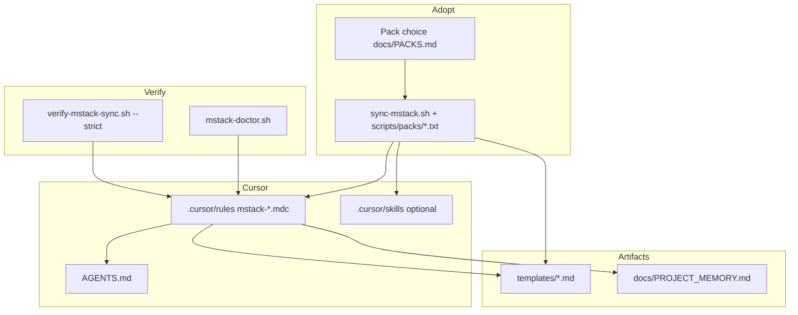

# mstack

[](LICENSE)
[](https://cursor.com)

**mstack** is a **Markdown-first Cursor Agent workflow pack**: phase-separated work, token discipline, permission gates, and specialist rules you can **copy into any codebase**. It ships as `.cursor/rules/*.mdc`, root **`AGENTS.md`**, and **`templates/`**.

This repository is also a **reference implementation**: it includes **`docs/`** for agent-oriented memory and an optional **Ideas HTTP API** (`src/`, `tests/`) that exercises structured API patterns.

Inspired by the “virtual team” workflow idea popularized by [GStack](https://github.com/garrytan/gstack) (Claude Code). **mstack is independent** content for Cursor; it is not a fork of GStack.

**Reality check:** mstack is **team glue and guardrails**, not automatic model intelligence. See **[docs/EFFECTIVENESS.md](docs/EFFECTIVENESS.md)** for when it tends to help, when it does not, and known weak spots. **Token habits (honest):** **[docs/TOKEN_LEVERS.md](docs/TOKEN_LEVERS.md)**.

If this helps your team, **star the repo** and open a PR — see **[CONTRIBUTING.md](CONTRIBUTING.md)** and **[docs/SHOWCASE.md](docs/SHOWCASE.md)**.

**Fastest install (another repo):** **[docs/STARTER_KIT.md](docs/STARTER_KIT.md)** — sync, doctor, first Agent messages.

### At a glance (how pieces connect)



---

## What you get

| Area | What it does |
| ---- | ------------ |
| **Phases** | Think → Plan → Build → Review → Test → Ship → Reflect, with explicit handoffs (`mstack-core-workflow.mdc`). |
| **Token discipline** | Search-first, bounded reads, summary-before-edit (`mstack-token-discipline.mdc`). |
| **Destructive actions** | Confirm before `git reset --hard`, force push, broad deletes, DB drops, prod changes (`mstack-permissions.mdc`). |
| **Cursor Plan Mode** | Multi-step planning before code; aligns with `templates/PLAN_TEMPLATE.md` ([docs](https://cursor.com/docs/agent/plan-mode)). |
| **Cursor Debug Mode** | Runtime hypotheses and instrumentation; mstack adds **consent** before invasive logging ([docs](https://cursor.com/docs/agent/debug-mode)). |
| **Model strategy** | Advisory tier hints (lighter vs stronger) and token tips in chat—**rules cannot switch your model** (`mstack-model-strategy.mdc`). |
| **Design research** | Optional web inspiration **only with your permission** (`mstack-design-research.mdc`). |
| **Specialists** | Scoped rules for frontend, backend, a11y, data, CI, docs, security, review, dependencies, web perf, AI product, API contracts, observability, releases, session handoff, and more (see table below). |
| **Templates** | Plan, tests, PRs, ADRs, postmortems, debug sessions, reflect, model notes, OpenAPI delta, runbook (see list below). |
| **Rule packs** | Minimal / **Lite** / **Solo** / standard / full — **[docs/PACKS.md](docs/PACKS.md)** + **`scripts/packs/*.txt`** for `sync-mstack.sh`. |
| **Project memory** | Durable **design and product** prefs in **`docs/PROJECT_MEMORY.md`**; Agent reads before UI work and updates when you lock decisions (`mstack-project-memory.mdc`). Not a full chat log. |

---

## Workflow at a glance

| Phase | Purpose | Typical artifact |
| ----- | ------- | ---------------- |
| **Think** | Goal, constraints, assumptions; optional **Model note** for non-trivial work | — |
| **Plan** | Architecture, risks, files to touch; use **Cursor Plan Mode** when scope is large or unclear | `templates/PLAN_TEMPLATE.md` |
| **Build** | Minimal diff; match repo conventions | — |
| **Review** | Adversarial pass; no new features | `@mstack-review` |
| **Test** | Proportionate coverage | `templates/TEST_PLAN_TEMPLATE.md` |
| **Ship** | Lint/tests, migrations, docs, PR readiness | `templates/PR_CHECKLIST_TEMPLATE.md`, ADR if needed |
| **Reflect** | What worked; what to automate | `templates/REFLECT_TEMPLATE.md` |

Human-readable detail: **[docs/workflow.md](docs/workflow.md)**. Preset rule bundles: **[docs/PACKS.md](docs/PACKS.md)**.

## Documentation (reference)

| Doc | Purpose |
| --- | ------- |
| [docs/STARTER_KIT.md](docs/STARTER_KIT.md) | One-page sync + doctor + first messages (**fastest path**) |
| [docs/VENDOR_UPGRADE.md](docs/VENDOR_UPGRADE.md) | Refresh vendored/submodule mstack + re-sync + verify |
| [docs/MONOREPO.md](docs/MONOREPO.md) | One vendor copy, nested `AGENTS.md`, package `@` context |
| [docs/ONBOARDING.md](docs/ONBOARDING.md) | 5-minute first-time adoption |
| [docs/PLAYBOOK.md](docs/PLAYBOOK.md) | Sprint shape, handoffs, modes |
| [docs/GSTACK_INSPIRATION.md](docs/GSTACK_INSPIRATION.md) | How mstack maps to GStack-style ideas (not a fork) |
| [docs/TROUBLESHOOTING.md](docs/TROUBLESHOOTING.md) | Rules, globs, AGENTS, sync issues |
| [docs/CURSOR_LIMITS.md](docs/CURSOR_LIMITS.md) | What project rules cannot do (model, modes, persistence) |
| [docs/CURSOR_INTEGRATION.md](docs/CURSOR_INTEGRATION.md) | Cursor Rules, Skills, modes — **Agent vs IDE** when to use which |
| [docs/POWER_USER.md](docs/POWER_USER.md) | Session brief file, verify sync in CI, mechanical pass |
| [docs/EFFECTIVENESS.md](docs/EFFECTIVENESS.md) | Honest usefulness bands, weaknesses, how to get value |
| [docs/TOKEN_LEVERS.md](docs/TOKEN_LEVERS.md) | What actually reduces wasted context (no magic savings) |
| [docs/CONTEXT_BUDGET.md](docs/CONTEXT_BUDGET.md) | File caps + recap habits; pairs with **`/mstack-context-budget`** |
| [docs/SPECIALIST_MAP.md](docs/SPECIALIST_MAP.md) | Which specialist to drop when trimming overlap |
| [docs/ADOPTION_AUDIT.md](docs/ADOPTION_AUDIT.md) | Checklist for correct install and drift |
| [docs/PLAYBOOK_FIRST_MESSAGES.md](docs/PLAYBOOK_FIRST_MESSAGES.md) | Copy-paste Agent chat openers |
| [docs/RECIPES.md](docs/RECIPES.md) | Task → `@mention` / skill → template index |
| [docs/TEAM_ROLLOUT.md](docs/TEAM_ROLLOUT.md) | Champion guide: pilot pack, agreements, first-week links |
| [docs/RULES_SOURCE.md](docs/RULES_SOURCE.md) | Vendor + `sync-mstack.sh` vs Cursor remote rule import |
| [docs/SKILLS.md](docs/SKILLS.md) | Index of **`/mstack-*`** commands and skill paths |

---

## Rules reference (`.cursor/rules/`)

Rules use YAML frontmatter (`description`, `globs`, `alwaysApply`). See [Cursor Rules](https://cursor.com/docs/rules). You can **@mention** a rule in chat (e.g. `@mstack-debug`, `@mstack-model-strategy`).

| File | Always / scoped | Role |
| ---- | --------------- | ---- |
| `mstack-core-workflow.mdc` | Always | Phase machine, handoffs, optional invocations, artifact index. |
| `mstack-token-discipline.mdc` | Always | Bounded exploration; applies during Plan/Debug/review too. |
| `mstack-permissions.mdc` | Always | Gate destructive git, filesystem, DB, production operations. |
| `mstack-frontend.mdc` | Globbed UI files | Components, layout, performance, UI quality. |
| `mstack-accessibility.mdc` | Globbed UI files | Semantics, keyboard, focus, forms, motion, contrast. |
| `mstack-design-research.mdc` | Globbed UI + pages | Moodboard-style research; **web only if user permits**. |
| `mstack-backend.mdc` | API / server paths | Validation, errors, idempotency, logging. |
| `mstack-data-modeling.mdc` | Schema, SQL, ORM, migrations | Safe schema evolution, rollout, nullability. |
| `mstack-data-migrations.mdc` | Migration folders | Narrow migration safety (pairs with data modeling). |
| `mstack-testing-qa.mdc` | Tests / e2e dirs | Pyramid, repro, flakiness, reporting. |
| `mstack-review.mdc` | Common source globs | PR/code review posture; no implementation creep. |
| `mstack-ci-quality.mdc` | Workflows, eslint/tsconfig/biome | CI ordering, determinism, secrets in CI. |
| `mstack-ci.mdc` | Workflow YAML | Targeted pipeline fixes without disabling checks. |
| `mstack-docs-devx.mdc` | README, docs, GitHub templates | Contributor-facing accuracy, less sprawl. |
| `mstack-docs-ship.mdc` | README, docs, CHANGELOG | Ship-oriented doc and changelog touchpoints. |
| `mstack-dependencies.mdc` | Manifests + lockfiles | Intentional bumps, lockfile hygiene, supply-chain mindset. |
| `mstack-security-review.mdc` | Auth, API, server, webhooks | Lightweight STRIDE/OWASP-style pass at boundaries. |
| `mstack-debug.mdc` | On demand / mention | Cursor Debug Mode alignment; **consent** for instrumentation. |
| `mstack-model-strategy.mdc` | On demand / mention | Task taxonomy; lighter vs stronger tier **suggestions** only. |
| `mstack-session-handoff.mdc` | On demand / mention | Fresh chat or parallel agents; minimal briefing and plan path. |
| `mstack-web-performance.mdc` | UI + bundler globs | Core Web Vitals mindset, lazy loading, fonts, CLS. |
| `mstack-ai-product.mdc` | AI / LLM / RAG paths | Prompt injection awareness, tools, PII minimization, streaming UX. |
| `mstack-api-contracts.mdc` | API / OpenAPI / routes | Versioning, error consistency, spec deltas. |
| `mstack-observability.mdc` | API, server, tracing paths | Structured logs, traces, metrics, correlation IDs. |
| `mstack-release-versioning.mdc` | CHANGELOG, release CI, manifests | Semver, changelog, tags. |
| `mstack-secrets-env.mdc` | `.env*`, workflows, compose, credentials paths | No secrets in git; CI secret stores; redaction. |
| `mstack-i18n-localization.mdc` | Locales, i18n, `*.po`, message catalogs | ICU/MessageFormat; RTL; locale formatting (**full** pack). |
| `mstack-feature-flags.mdc` | Flags, experiments, LD/Unleash-style paths | Safe defaults, kill switch, server vs client (**standard** + **full**). |
| `mstack-privacy-data-handling.mdc` | Privacy, retention, export/delete, PII paths | Minimization, logging; not legal advice (**full**). |
| `mstack-open-source-license.mdc` | `LICENSE`, `NOTICE`, `third_party/` | Attribution, SPDX; not legal advice (**full**). |
| `mstack-repo-memory.mdc` | `docs/`, `src/`, `tests/`, `AGENTS.md`, `README` in **this** repo | Points agents at `docs/AGENT_MEMORY.md`, `ARCHITECTURE.md`, `DECISIONS.md`, `PROJECT_MEMORY.md`. |
| `mstack-project-memory.mdc` | `PROJECT_MEMORY.md`, design brief, `theme/`, `tokens/` | Read/update durable design and product preferences. |
| `mstack-product-review.mdc` | On demand / mention | Product challenge before large plan; **no code** |
| `mstack-documentation-pass.mdc` | README, `docs/`, changelog globs | Doc alignment before Ship |
| `mstack-mechanical-pass.mdc` | On demand / mention | Compress phases for chores; not for auth/migrations/new UX |
| `mstack-surgical-investigation.mdc` | On demand / mention | Hypothesis + file budget before wide reads (**standard** + **full**) |
| `mstack-adoption-audit.mdc` | On demand / mention | Walk `docs/ADOPTION_AUDIT.md`; report gaps (**full** pack) |
| `mstack-breaking-change.mdc` | On demand / mention | Breaking API/schema/deps; **`BREAKING_CHANGE_CHECKLIST.md`** (**full** pack) |

**Overlapping specialists:** Some pairs cover similar areas with different scope—for example `mstack-docs-devx` vs `mstack-docs-ship`, `mstack-data-modeling` vs `mstack-data-migrations`, `mstack-ci-quality` vs `mstack-ci`. Keep both or delete one set when vendoring into a smaller project.

**Recommended minimum when copying elsewhere:** `mstack-core-workflow`, `mstack-token-discipline`, `mstack-permissions`.

---

## Templates (`templates/`)

| Template | Use |
| -------- | --- |
| `PLAN_TEMPLATE.md` | Plan phase; align with Cursor Plan Mode output. |
| `TEST_PLAN_TEMPLATE.md` | QA and test design. |
| `DESIGN_BRIEF_TEMPLATE.md` | UI/UX before build. |
| `DEBUG_SESSION_TEMPLATE.md` | Repro, hypotheses, **permission** for invasive debug. |
| `SESSION_BRIEF_TEMPLATE.md` | Shape for root **`SESSION_BRIEF.md`** — durable handoff between Cursor chats. |
| `AGENT_RECAP_TEMPLATE.md` | Optional **`docs/AGENT_RECAP.md`** — compact mid-thread recap; **`/mstack-lean-handoff`**. |
| `MSTACK_DAY_ONE_CHECKLIST.md` | First-day onboarding checks; pairs with **`docs/STARTER_KIT.md`**. |
| `HOTFIX_OR_ROLLBACK_CHECKLIST.md` | Prod hotfix / rollback trace; then **`POSTMORTEM_TEMPLATE.md`**. |
| `BREAKING_CHANGE_CHECKLIST.md` | Breaking API/schema/deps; **`@mstack-breaking-change`** (**full** pack). |
| `REFLECT_TEMPLATE.md` | Reflect phase after non-trivial work. |
| `POSTMORTEM_TEMPLATE.md` | Incident write-up. |
| `INCIDENT_POSTMORTEM_TEMPLATE.md` | Alternate postmortem structure. |
| `PR_CHECKLIST_TEMPLATE.md` | Scope, risk, tests, rollback before merge. |
| `ADR_TEMPLATE.md` | Architecture decision records. |
| `MODEL_STRATEGY_NOTE_TEMPLATE.md` | Longer model/tier/token session notes (advisory). |
| `OPENAPI_DELTA_TEMPLATE.md` | Summarize API or OpenAPI changes for PRs or releases. |
| `RUNBOOK_TEMPLATE.md` | Deploy, health checks, rollback, on-call. |
| `PROJECT_MEMORY_TEMPLATE.md` | Copy to `docs/PROJECT_MEMORY.md` in consumer repos; design/product standing prefs. |
| `PRODUCT_REVIEW_TEMPLATE.md` | Product posture before big bets (GStack-style “CEO review” intent) |
| `PRODUCT_REVIEW_LITE.md` | Five-field product check for smaller initiatives |
| `DOC_TASK_TEMPLATE.md` | Checklist of docs to update after a change |
| `RISK_REGISTER_TEMPLATE.md` | Living risk table for initiatives |
| `SECRETS_AND_ENV_CHECKLIST.md` | Before PRs touching env, CI, credentials |
| `LOCALIZATION_QA_TEMPLATE.md` | Locale matrix, truncation, date/number checks |
| `RELEASE_OWNER_CHECKLIST.md` | Release owner: version, changelog, migrations, rollback |
| `PRIVACY_IMPACT_LITE.md` | Data purpose, retention, access (not legal advice) |
| `FEATURE_FLAG_CHANGE_CHECKLIST.md` | Flag rollout, rollback, docs |
| `LICENSE_HYGIENE_CHECKLIST.md` | NOTICE, third-party, root license (not legal advice) |

---

## Cursor integration (modes and permissions)

mstack targets **Cursor Agent** (chat + project rules). It **pairs with** normal IDE work—editor, search, terminal, debugger, Tab—for fast local edits; use Agent + phases when scope is wide or you want rule-consistent behavior. See **[docs/CURSOR_INTEGRATION.md](docs/CURSOR_INTEGRATION.md)**.

- **Modes:** Use the Agent **mode picker** or **Shift+Tab** to switch **Agent**, **Plan**, and **Debug** modes ([Plan](https://cursor.com/docs/agent/plan-mode), [Debug](https://cursor.com/docs/agent/debug-mode)).
- **Plan Mode:** Best for unclear requirements or many files; refine the plan before Build.
- **Debug Mode:** Best for runtime evidence; mstack still requires **your OK** before extra logging or reproduce-for-logs steps (`mstack-debug.mdc`).
- **Model picker / Auto:** mstack may suggest a **faster vs more capable** tier in chat; **only you** can change the model—project rules cannot.
- **Web:** No external fetches for design research unless you **explicitly allow** it for that task.

### Cursor Canvas (3.1+)

[Canvas](https://cursor.com/docs/agent/tools/canvas) lets the agent open **interactive dashboards** (tables, diagrams, todos) as durable artifacts in the Agents Window. This repo includes project skills: **`mstack-flight-deck`** — type **`/mstack-flight-deck`** for a Canvas overview (phases, docs, Ideas API; `node scripts/ideas-snapshot.mjs`). **`mstack-doctor`** — type **`/mstack-doctor`** to run local install checks (`scripts/mstack-doctor.sh`). **`mstack-pack-picker`** — type **`/mstack-pack-picker`** to choose **`MSTACK_PACK`**. **`mstack-first-sync`** — type **`/mstack-first-sync`** for copy-paste sync + merge hints when adopting in a new repo. **`mstack-upgrade-vendor`** — type **`/mstack-upgrade-vendor`** after updating **`vendor/mstack`** (submodule pull → re-sync → doctor). **`mstack-context-budget`** — type **`/mstack-context-budget`** for a pasteable **file cap + narrow `@`** block (long threads). Paths: `.cursor/skills/mstack-flight-deck/SKILL.md`, `.cursor/skills/mstack-doctor/SKILL.md`, `.cursor/skills/mstack-pack-picker/SKILL.md`, `.cursor/skills/mstack-first-sync/SKILL.md`, `.cursor/skills/mstack-upgrade-vendor/SKILL.md`, `.cursor/skills/mstack-context-budget/SKILL.md`.

---

## Quick start (consume mstack in another repo)

Prefer the single-page guide: **[docs/STARTER_KIT.md](docs/STARTER_KIT.md)**. Or follow the steps below.

1. Copy **`AGENTS.md`**, **`.cursor/rules/mstack-*.mdc`**, and optionally **`templates/`** into your project.
2. Merge **`AGENTS.md`** with your existing file if needed.
3. In Cursor, rules load from **`.cursor/rules/`** and **`AGENTS.md`** per [Cursor Rules](https://cursor.com/docs/rules).
4. Say: *Use mstack phases* or step through **Think → Plan → Build**.

### Copy install

```bash
# In your app repo root
cp /path/to/mstack/AGENTS.md .
mkdir -p .cursor/rules templates
cp /path/to/mstack/.cursor/rules/mstack-*.mdc .cursor/rules/
cp -r /path/to/mstack/templates/* templates/
```

### Git submodule

```bash
git submodule add <this-repo-url> vendor/mstack
mkdir -p .cursor/rules
ln -sf ../../vendor/mstack/.cursor/rules/mstack-*.mdc .cursor/rules/
cp vendor/mstack/AGENTS.md ./AGENTS.md.mstack-snippet   # merge manually into your AGENTS.md
```

Re-init after clone: `git submodule update --init --recursive`.

### Sync script

From your app repo with mstack at `vendor/mstack`:

```bash
chmod +x vendor/mstack/scripts/sync-mstack.sh
# Curated pack + project memory bootstrap (recommended for most apps)
MSTACK_ROOT=vendor/mstack MSTACK_PACK=standard INIT_PROJECT_MEMORY=1 vendor/mstack/scripts/sync-mstack.sh
```

**Defaults:** **`MSTACK_PACK=all`** copies every **`mstack-*.mdc`** (same as before). Set **`MSTACK_PACK`** to `minimal`, `lite`, `solo`, `standard`, or `full` to copy only the rules listed in **`vendor/mstack/scripts/packs/<pack>.txt`**. **`SYNC_TEMPLATES=0`** skips **`templates/*.md`**. **`INIT_PROJECT_MEMORY=1`** creates **`docs/PROJECT_MEMORY.md`** from the template if missing.

**Doctor** (required trio + optional strict pack check): `bash vendor/mstack/scripts/mstack-doctor.sh .` — with `MSTACK_ROOT`, `MSTACK_PACK`, and `MSTACK_VERIFY_STRICT=1` also runs verify. In this repo: `npm run mstack:doctor`.

**Verify** `.cursor/rules` matches the pack (e.g. in CI): `MSTACK_ROOT=vendor/mstack vendor/mstack/scripts/verify-mstack-sync.sh --strict standard`. Example workflow: **`.github/workflows/mstack-pack-verify.yml.example`**. See **[docs/POWER_USER.md](docs/POWER_USER.md)**.

Also copies **`templates/*.md`** (unless skipped) and **`.cursor/skills/*`** when present. With **`SYNC_AGENTS_SNIPPET=1`**, also writes **`AGENTS.md.mstack-snippet`** for manual merge.

### Subset of rules

Remove any specialist you do not need. For curated lists (**minimal**, **lite**, **solo**, **standard**, **full**), see **[docs/PACKS.md](docs/PACKS.md)** and use **`MSTACK_PACK`**. At minimum, keep **`mstack-core-workflow.mdc`**, **`mstack-token-discipline.mdc`**, and **`mstack-permissions.mdc`**.

---

## Working in *this* repository

When you change the **Ideas API**, routes, env vars, or layout, update:

- **[docs/AGENT_MEMORY.md](docs/AGENT_MEMORY.md)** — orientation and glossary  
- **[docs/ARCHITECTURE.md](docs/ARCHITECTURE.md)** — system map  
- **[docs/DECISIONS.md](docs/DECISIONS.md)** — decision log  
- **[docs/PROJECT_MEMORY.md](docs/PROJECT_MEMORY.md)** — design language, product terminology, standing user preferences (when explicitly agreed)

Rule **`mstack-repo-memory.mdc`** reminds agents to use these when editing `docs/`, `src/`, or `tests/` here. Rule **`mstack-project-memory.mdc`** applies when editing project memory, design briefs, or theme/tokens paths.

---

## Repo layout

```text
AGENTS.md
CONTRIBUTING.md
CODE_OF_CONDUCT.md
CHANGELOG.md
LICENSE
README.md
.github/
  workflows/mstack-pack-verify.yml.example
  ISSUE_TEMPLATE/
  PULL_REQUEST_TEMPLATE.md
.cursor/rules/mstack-*.mdc
.cursor/skills/mstack-flight-deck/
.cursor/skills/mstack-doctor/
.cursor/skills/mstack-pack-picker/
.cursor/skills/mstack-lean-handoff/
.cursor/skills/mstack-first-sync/
.cursor/skills/mstack-upgrade-vendor/
.cursor/skills/mstack-context-budget/
docs/
  workflow.md
  CONTEXT_BUDGET.md
  STARTER_KIT.md
  VENDOR_UPGRADE.md
  MONOREPO.md
  RECIPES.md
  TEAM_ROLLOUT.md
  RULES_SOURCE.md
  SKILLS.md
  ONBOARDING.md
  PLAYBOOK.md
  GSTACK_INSPIRATION.md
  TROUBLESHOOTING.md
  CURSOR_LIMITS.md
  CURSOR_INTEGRATION.md
  POWER_USER.md
  ADOPTION_AUDIT.md
  PLAYBOOK_FIRST_MESSAGES.md
  TOKEN_LEVERS.md
  EFFECTIVENESS.md
  SPECIALIST_MAP.md
  SHOWCASE.md
  FAQ.md
  PACKS.md
  AGENT_MEMORY.md
  ARCHITECTURE.md
  DECISIONS.md
  PROJECT_MEMORY.md
scripts/sync-mstack.sh
scripts/verify-mstack-sync.sh
scripts/mstack-doctor.sh
scripts/mstack-ci-local.sh
scripts/verify-packs-internal.sh
scripts/packs/*.txt
scripts/ideas-snapshot.mjs
templates/*.md
package.json          # Ideas API
src/                  # Ideas API
tests/                # Ideas API
```

---

## Ideas HTTP API (demo service in this repo)

A small **Node/TypeScript** HTTP service: validation, session preferences, idempotency, rate limits. Data is **in-memory**; restart clears it.

### Run

```bash
npm install
npm run dev
```

Default port **`3000`** (`PORT`). Optional: **`RATE_LIMIT_MAX`**, **`RATE_LIMIT_WINDOW_MS`**.

### Endpoints

| Method | Path | Notes |
| ------ | ---- | ----- |
| `GET` | `/health` | Liveness |
| `GET` | `/v1/meta` | Service name, API version, Node version |
| `GET` | `/v1/openapi.json` | OpenAPI 3.0 spec (`src/openapi.ts`) |
| `GET` | `/v1/ideas?tag=&limit=&cursor=` | List ideas (paginated; default `limit=50`, max `100`; use `nextCursor` for more) |
| `GET` | `/v1/ideas/:id` | Single idea |
| `POST` | `/v1/ideas` | Create (`title`, optional `summary`, `tags`). Headers: optional `X-Session-ID`, optional `Idempotency-Key` |
| `PATCH` | `/v1/ideas/:id` | Partial update; optional `X-Session-ID` merges session default tags when `tags` sent |
| `DELETE` | `/v1/ideas/:id` | Remove idea |
| `PATCH` | `/v1/session/preferences` | Header **`X-Session-ID`** (required). Body: optional `defaultTags`, `summarizeTitles` |

Responses include **`X-Request-ID`** and JSON **`requestId`**.

### Test / build

```bash
npm test
npm run lint
npm run build && npm start
```

---

## Troubleshooting

Longer guide: **[docs/TROUBLESHOOTING.md](docs/TROUBLESHOOTING.md)**.

| Issue | What to try |
| ----- | ----------- |
| Verify before a PR | Run **`npm run mstack:ci`** locally (packs, doctor, sync smoke, lint, test). |
| Rules not applying | Files under **`.cursor/rules/`**; `.mdc` or `.md`; check **Cursor Settings → Rules**. |
| Too much guidance | Drop specialist rules; trim **`AGENTS.md`**. |
| Wrong rule for files | Adjust **`globs`** in each `.mdc` to match your tree. |
| Merge / vendoring | Use **`sync-mstack.sh`** or copy only the rules you need. |

---

## License

MIT — see [LICENSE](LICENSE).

## Contributing

- [CONTRIBUTING.md](CONTRIBUTING.md)
- [CODE_OF_CONDUCT.md](CODE_OF_CONDUCT.md)
- [CHANGELOG.md](CHANGELOG.md)
- [docs/FAQ.md](docs/FAQ.md)
- [docs/SHOWCASE.md](docs/SHOWCASE.md)
