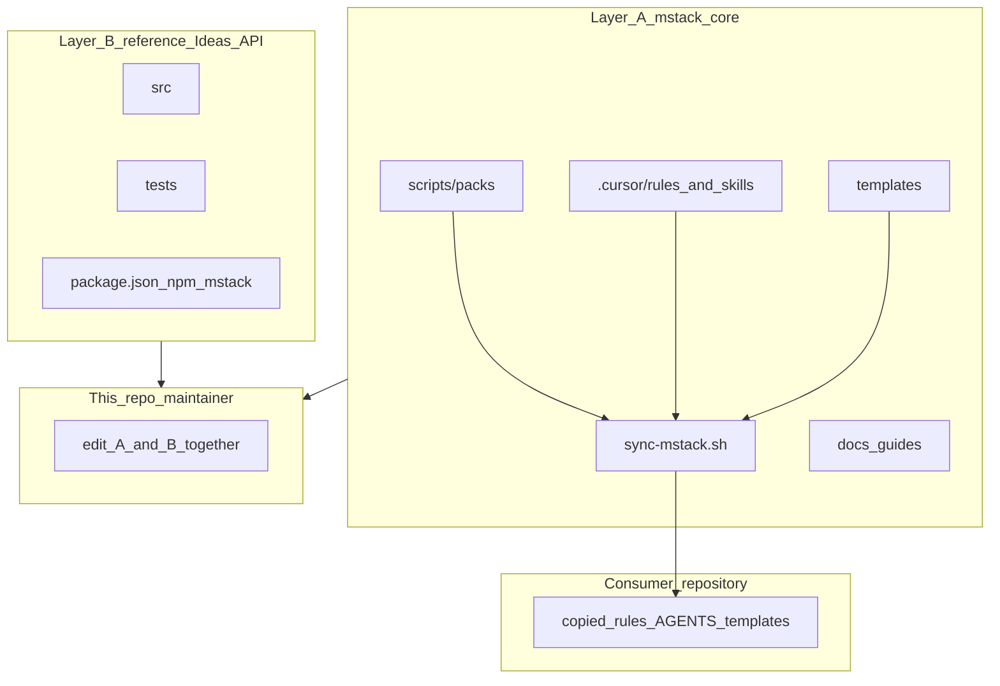
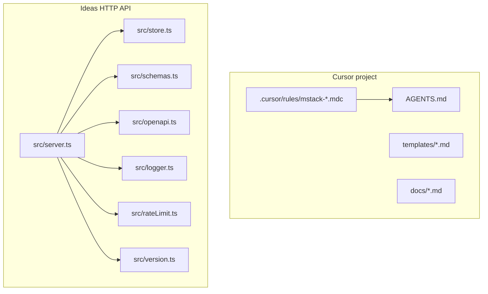

# Architecture

High-level map of this repository: **mstack workflow pack** plus an optional **Ideas API** service.

**End-to-end demo (this repo):** [DEMO_WALKTHROUGH.md](DEMO_WALKTHROUGH.md) · **Reference API modules:** [SRC_INTERNAL.md](SRC_INTERNAL.md) · **Example artifacts:** [sample-workflow/README.md](sample-workflow/README.md)

## Repository layout (contributors)

**Layer A (mstack core)** is what consumers copy via `sync-mstack.sh`. **Layer B (reference app)** lives only in this repo to demonstrate structured API patterns.

## Directory roles

| Path | Role |
| ---- | ---- |
| `.cursor/rules/` | Cursor Rules (`.mdc`): phases, specialists, token discipline. |
| `AGENTS.md` | Short bootstrap for agents; points at rules and templates. |
| `templates/` | Plan, test plan, design brief, debug, reflect, postmortem skeletons. |
| `docs/` | Human/agent narrative: workflow, **this file**, decisions, agent memory. |
| `scripts/sync-mstack.sh` | Copy rules/templates into another repo (submodule workflow). |
| `src/` | HTTP server: routing, validation, OpenAPI doc (`openapi.ts`), observability hooks. |
| `tests/` | Vitest integration tests against `createAppServer()`. |

## Ideas API — request lifecycle

1. **Correlation**: Every response sets `X-Request-ID` (from client header or generated UUID).
2. **Rate limit**: Sliding window per client key (`X-Session-ID` if present, else first `X-Forwarded-For` hop or socket address). Tunable via `RATE_LIMIT_MAX`, `RATE_LIMIT_WINDOW_MS`.
3. **Routing**: `handleRequest` in `src/server.ts` dispatches by method + path. JSON bodies parsed once; errors return structured `{ error, message, requestId }` (and `details` for Zod failures).
4. **Listing**: `GET /v1/ideas` returns a **paginated** window (default `limit=50`, max `100`) sorted by `createdAt` descending, tie-broken by `id`. Pass `cursor` from `nextCursor` to fetch the next page. Invalid `limit` or `cursor` returns **400** with `invalid_limit` / `invalid_cursor`.
5. **State**: `src/store.ts` — default **`InMemoryIdeasStore`** (not durable). Optional **`FileIdeasStore`** when **`IDEAS_STORE_PATH`** is set (JSON snapshot on each mutation; demo-only concurrency). **`POST /v1/ideas`** with the same **`Idempotency-Key`** replays when the body matches; **409** `idempotency_conflict` when the key is reused with a different body.

## Ideas API — data model (in-memory)

- **Idea**: `id`, `title`, `summary?`, `tags[]`, `createdAt`, `updatedAt`.
- **Session preferences**: `defaultTags[]`, `summarizeTitles` — affect **new** ideas and **updates** that include a title (normalization) or tags (default tags merged with provided tags).

## Ideas API — endpoints (summary)

| Method | Path | Purpose |
| ------ | ---- | ------- |
| GET | `/health` | Liveness. |
| GET | `/v1/meta` | `product` (mstack), `service` (mstack-ideas-api), API version, Node version. |
| GET | `/v1/openapi.json` | OpenAPI 3.0 document (`src/openapi.ts`). |
| GET | `/v1/ideas` | List ideas; optional `?tag=`, `?limit=`, `?cursor=` (see lifecycle). |
| GET | `/v1/ideas/:id` | Single idea. |
| POST | `/v1/ideas` | Create; optional `X-Session-ID`, `Idempotency-Key`. |
| PATCH | `/v1/ideas/:id` | Partial update; optional `X-Session-ID` for prefs-aware title/tags. |
| DELETE | `/v1/ideas/:id` | Remove idea; clears matching idempotency entries. |
| PATCH | `/v1/session/preferences` | Session prefs; requires `X-Session-ID`. |

## Configuration

| Variable | Default | Meaning |
| -------- | ------- | ------- |
| `PORT` | `3000` | Listen port. |
| `RATE_LIMIT_MAX` | `120` | Max requests per window per client key. |
| `RATE_LIMIT_WINDOW_MS` | `60000` | Window length in ms. |
| `IDEAS_STORE_PATH` | _(unset)_ | If set, persist ideas to this JSON file (`FileIdeasStore`). |

## Testing and build

- `npm test` — Vitest, hits a real `http.Server` on an ephemeral port.
- `npm run lint` — `tsc --noEmit`.
- `npm run build` — Emit to `dist/`; `npm start` runs `node dist/server.js`.
