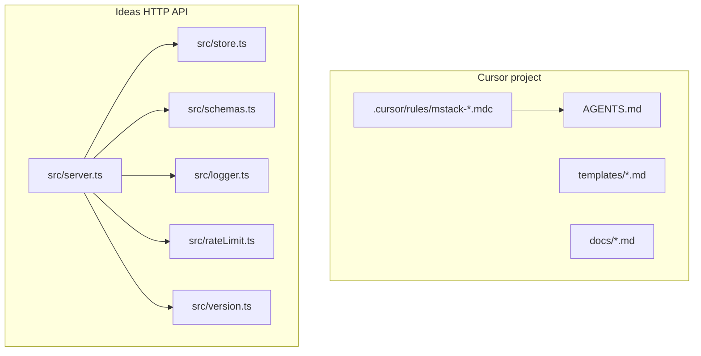

# Architecture

High-level map of this repository: **mstack workflow pack** plus an optional **Ideas API** service.

## Directory roles

| Path | Role |
| ---- | ---- |
| `.cursor/rules/` | Cursor Rules (`.mdc`): phases, specialists, token discipline. |
| `AGENTS.md` | Short bootstrap for agents; points at rules and templates. |
| `templates/` | Plan, test plan, design brief, debug, reflect, postmortem skeletons. |
| `docs/` | Human/agent narrative: workflow, **this file**, decisions, agent memory. |
| `scripts/sync-mstack.sh` | Copy rules/templates into another repo (submodule workflow). |
| `src/` | HTTP server: routing, validation, observability hooks. |
| `tests/` | Vitest integration tests against `createAppServer()`. |

## Ideas API — request lifecycle

1. **Correlation**: Every response sets `X-Request-ID` (from client header or generated UUID).
2. **Rate limit**: Sliding window per client key (`X-Session-ID` if present, else first `X-Forwarded-For` hop or socket address). Tunable via `RATE_LIMIT_MAX`, `RATE_LIMIT_WINDOW_MS`.
3. **Routing**: `handleRequest` in `src/server.ts` dispatches by method + path. JSON bodies parsed once; errors return structured `{ error, message, requestId }` (and `details` for Zod failures).
4. **State**: `src/store.ts` holds in-memory `Map`s for ideas, sessions, and idempotency keys. **Not durable** across restarts.

## Ideas API — data model (in-memory)

- **Idea**: `id`, `title`, `summary?`, `tags[]`, `createdAt`, `updatedAt`.
- **Session preferences**: `defaultTags[]`, `summarizeTitles` — affect **new** ideas and **updates** that include a title (normalization) or tags (default tags merged with provided tags).

## Ideas API — endpoints (summary)

| Method | Path | Purpose |
| ------ | ---- | ------- |
| GET | `/health` | Liveness. |
| GET | `/v1/meta` | Service name, API version, Node version. |
| GET | `/v1/ideas` | List ideas; optional `?tag=`. |
| GET | `/v1/ideas/:id` | Single idea. |
| POST | `/v1/ideas` | Create; optional `X-Session-ID`, `Idempotency-Key`. |
| PATCH | `/v1/ideas/:id` | Partial update; optional `X-Session-ID` for prefs-aware title/tags. |
| DELETE | `/v1/ideas/:id` | Remove idea; clears matching idempotency entries. |
| PATCH | `/v1/session/preferences` | Session prefs; requires `X-Session-ID`. |

## Configuration

| Variable | Default | Meaning |
| -------- | ------- | ------- |
| `PORT` | `3000` | Listen port. |
| `RATE_LIMIT_MAX` | `120` | Max requests per window per client key. |
| `RATE_LIMIT_WINDOW_MS` | `60000` | Window length in ms. |

## Testing and build

- `npm test` — Vitest, hits a real `http.Server` on an ephemeral port.
- `npm run lint` — `tsc --noEmit`.
- `npm run build` — Emit to `dist/`; `npm start` runs `node dist/server.js`.
