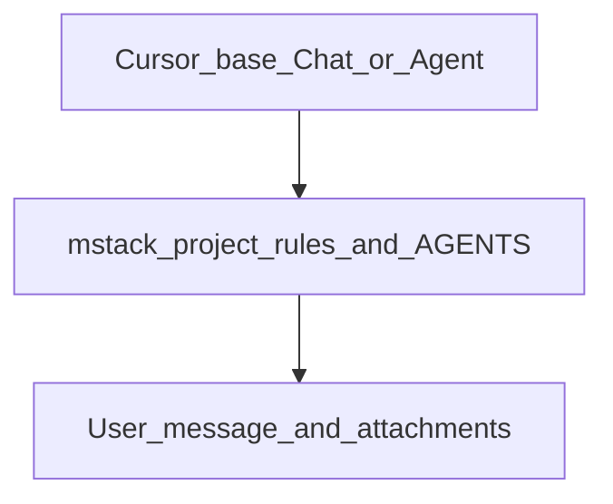

# Cursor base behavior + mstack

**What this is:** A **stable, paraphrased** note on how Cursor’s **built-in** Chat vs Agent instructions relate to **mstack** project rules. It is **not** a copy of Cursor’s system prompts (those change with the product).

**Verbatim snapshots** (research / curiosity): [system-prompts-and-models-of-ai-tools — Cursor Prompts](https://github.com/Manoj7ar/system-prompts-and-models-of-ai-tools/tree/main/Cursor%20Prompts).

**Deeper Cursor × IDE map:** [CURSOR_INTEGRATION.md](CURSOR_INTEGRATION.md) · **Limits:** [CURSOR_LIMITS.md](CURSOR_LIMITS.md)

---

## How instructions stack

Cursor applies **roughly** this order (simplified):

1. **Product / system** behavior for the surface you chose (**Chat** vs **Agent**).
2. **Rules:** Team → Project (mstack) → User.
3. **Your message** and **attachments** (`@` files, folders, rules).

mstack **does not replace** Cursor’s base instructions; it **adds** repo-specific workflow, token habits, permissions, and templates.

---

## Chat vs Agent (posture)

| | **Chat / Composer** | **Agent** |
| -- | ------------------- | --------- |
| **Typical use** | Questions, small edits, quick explanations | Multi-file work, implementation until the task is done |
| **Edits** | Often **suggested** diff-style blocks; user applies | Prefers **edit tools** / patches over pasting whole files |
| **Exploration** | Can be lighter; user may paste context | Strong bias to **search / read** the workspace before guessing |
| **mstack** | Phases and templates are optional; token rule still helps | **Full value:** `AGENTS.md`, `@mstack-*`, Plan/Debug pairing |

Use the **smallest surface** that fits: [CURSOR_INTEGRATION.md](CURSOR_INTEGRATION.md#agent-vs-ide--when-to-use-which).

---

## Habits aligned with Cursor’s Agent-style prompts (and mstack)

These are **distilled** from public “Cursor Prompt” dumps; keep them **bounded** by [mstack-token-discipline.mdc](../.cursor/rules/mstack-token-discipline.mdc).

- **Batch read-only context** when requests are independent — typically **3–5** parallel reads or searches, not unbounded fan-out (avoids timeouts and noise).
- **Explore then narrow:** broad semantic / intent-shaped search first; **exact** search (`grep`-style) when you know symbols or strings.
- **Describe actions in plain language** to the user; **do not** lean on raw internal tool identifiers in user-facing text.
- **Citations:** for code **already in the repo**, use the line-range path form your project rules describe (see user rule pack / Cursor docs). For **new** code in chat, use normal fenced blocks with a language tag.
- **After non-trivial exploration:** one short **state-of-world** (≤15 lines) **before** large edits — same gate as mstack token discipline.
- **Complex work:** use **Plan Mode** when blast radius is unclear; align with `templates/PLAN_TEMPLATE.md`.
- **Handoffs:** read `SESSION_BRIEF.md` / `docs/AGENT_RECAP.md` / `docs/PROJECT_MEMORY.md` when present before re-spelunking.

**Kickoff paste block:** invoke **`/mstack-agent-habits`** in Agent chat.

---

## Where mstack deliberately differs

Public prompt dumps sometimes push **very verbose** code or **always-on** task tooling. In this repo:

- **Code style:** match **existing** project conventions; **minimal scope**; no drive-by refactors — [mstack-token-discipline.mdc](../.cursor/rules/mstack-token-discipline.mdc).
- **Tasks / todos:** use Cursor’s **task or todo UI** when your build supports it; mstack does **not** hardcode product-specific tool names in rules.
- **Permission gates:** web research, invasive debug, destructive actions still follow **`mstack-permissions.mdc`** and **`mstack-debug.mdc`** regardless of base prompt tone.

---

## See also

- [SKILLS.md](SKILLS.md) — **`/mstack-agent-habits`**, **`/mstack-context-budget`**, **`/mstack-ship-check`**
- [PLAYBOOK_FIRST_MESSAGES.md](PLAYBOOK_FIRST_MESSAGES.md) — copy-paste openers
- [CONTEXT_BUDGET.md](CONTEXT_BUDGET.md) — long threads
