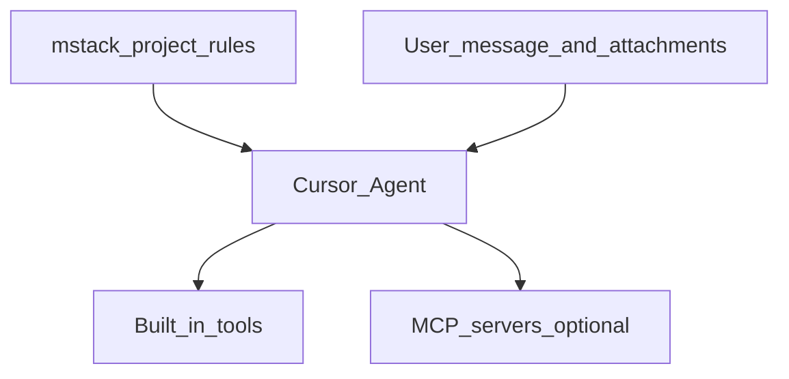

# mstack and Cursor MCP (Model Context Protocol)

**MCP** lets Cursor Agent call **extra tools and resources** beyond built-in repo search and edits—often databases, issue trackers, internal APIs, or docs indexes you configure as MCP servers.

Official Cursor docs: [MCP](https://cursor.com/docs/mcp) · Index: [cursor.com/llms.txt](https://cursor.com/llms.txt)

**mstack does not configure MCP for you.** This page explains how MCP **stacks** with project rules and where **safety** habits still apply.

---

## How it stacks

Cursor combines **built-in Agent tools**, optional **MCP servers**, **project rules** (mstack), and **your message**. mstack shapes **policy and workflow**; MCP adds **capabilities**.

Same precedence as always: **Team rules → Project rules → User rules** ([CURSOR_LIMITS.md](CURSOR_LIMITS.md)). MCP does not bypass mstack **permission** or **secrets** posture—you still gate risky work in chat.

---

## Safety alignment (treat MCP as external I/O)

- **Trust boundary** — Every MCP server is a **new surface**: what it can read, write, or call. Prefer **read-only** or **scoped** configs for exploration; separate **prod** servers from daily dev where possible.
- **Secrets** — Do not paste credentials into chat to “help” the agent use MCP. Use env vars and Cursor’s secret handling per your org. Pair with **`@mstack-secrets-env`** and [SECRETS_AND_ENV_CHECKLIST.md](../templates/SECRETS_AND_ENV_CHECKLIST.md) when changing env or CI.
- **Destructive actions** — MCP tools that mutate data (tickets, DB rows, deployments) are still **high blast radius**. Follow **`mstack-permissions.mdc`**: confirm with the user before irreversible or production-impacting steps.
- **Org policy** — Some teams require an allowlist of MCP servers. mstack cannot enforce that; security review does.

---

## When MCP helps vs YAGNI

| Use MCP when… | Skip or defer when… |
| --------------- | ------------------- |
| Agent repeatedly needs the same **external** source (issues, schema browser, internal docs API) | The task is **local code + tests** only |
| A server gives **structured**, bounded queries | You only need **web search** occasionally (and user permits research per `mstack-design-research`) |
| Your team already **owns** and **reviews** the server config | Solo **tiny** repo and you do not want more moving parts |

---

## See also

- [CURSOR_INTEGRATION.md](CURSOR_INTEGRATION.md) — Agent vs IDE, rules, skills  
- [CURSOR_LIMITS.md](CURSOR_LIMITS.md) — what rules cannot do  
- [RECIPES.md](RECIPES.md) — MCP / external tools row  
- [ANTI_PATTERNS.md](ANTI_PATTERNS.md) — MCP + prod without review
