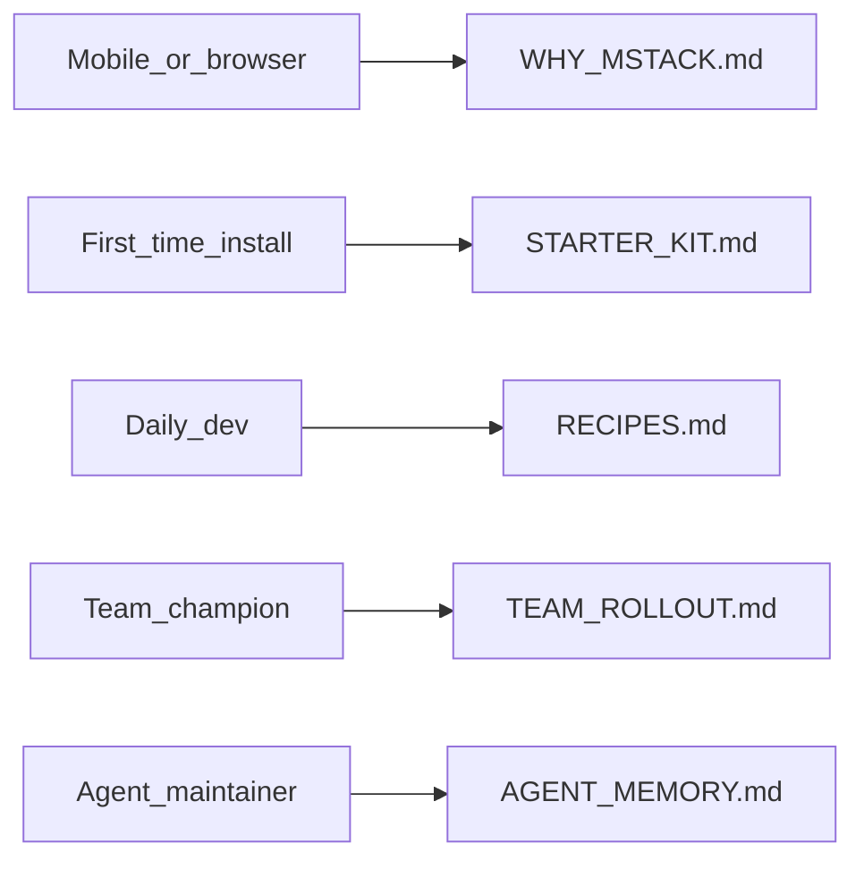

# Documentation map (read this first)

**Too many `docs/` files?** Pick **one path** below. Full index of **`/mstack-*` skills:** [SKILLS.md](SKILLS.md). Task → rule shortcuts: [RECIPES.md](RECIPES.md).

## Browsing on mobile / without Cursor yet

1. [WHY_MSTACK.md](WHY_MSTACK.md) — honest pitch and limits  
2. [STARTER_KIT.md](STARTER_KIT.md) — or raw copy: `https://raw.githubusercontent.com/Manoj7ar/mstack/main/docs/STARTER_KIT.md`  
3. [PACKS.md](PACKS.md) — which **`MSTACK_PACK`** to sync

## First-time human (installing in a repo)

1. [STARTER_KIT.md](STARTER_KIT.md) — sync, doctor, first Agent messages  
2. [ONBOARDING.md](ONBOARDING.md) — 5-minute narrative + pack diagram  
3. [FAQ.md](FAQ.md) — common questions  
4. [ADOPTION_AUDIT.md](ADOPTION_AUDIT.md) — optional self-check after sync

## Daily developer (already synced)

1. [RECIPES.md](RECIPES.md) — which `@mention` or skill for this task  
2. [PLAYBOOK_FIRST_MESSAGES.md](PLAYBOOK_FIRST_MESSAGES.md) — copy-paste openers  
3. [workflow.md](workflow.md) — phases and artifacts  
4. [CONTEXT_BUDGET.md](CONTEXT_BUDGET.md) + **`/mstack-context-budget`** — long threads  
5. [CURSOR_BASE_BEHAVIOR.md](CURSOR_BASE_BEHAVIOR.md) — Cursor base Chat/Agent + **`/mstack-agent-habits`**  
6. **`/mstack-ship-check`** — before opening a PR ([SKILLS.md](SKILLS.md))

## Team champion (rolling out to others)

1. [TEAM_ROLLOUT.md](TEAM_ROLLOUT.md) — pilot, agreements, first week  
2. [RULES_SOURCE.md](RULES_SOURCE.md) — submodule vs remote rule import  
3. [POWER_USER.md](POWER_USER.md) — verify sync, session brief  
4. [EFFECTIVENESS.md](EFFECTIVENESS.md) — set expectations with the team

## Agent / maintainer (this repo or heavy edits)

1. [AGENT_MEMORY.md](AGENT_MEMORY.md) — where to look first  
2. [ARCHITECTURE.md](ARCHITECTURE.md) — Ideas API map (if using `src/`)  
3. [DECISIONS.md](DECISIONS.md) — why things are the way they are  
4. [TROUBLESHOOTING.md](TROUBLESHOOTING.md) — rules, globs, sync

## Pick your role (diagram)

## Honesty and limits

- [CURSOR_LIMITS.md](CURSOR_LIMITS.md) — what project rules cannot do  
- [CURSOR_BASE_BEHAVIOR.md](CURSOR_BASE_BEHAVIOR.md) — product base prompts vs mstack (paraphrased)  
- [EFFECTIVENESS.md](EFFECTIVENESS.md) — when mstack helps vs adds noise

## See also

- [CURSOR_INTEGRATION.md](CURSOR_INTEGRATION.md) — Agent vs IDE  
- [SHOWCASE.md](SHOWCASE.md) — public adopters
