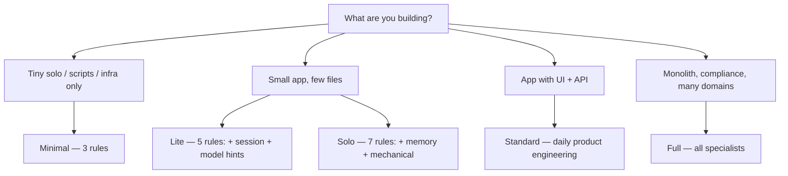

# mstack — 5-minute onboarding

Use this path when you first adopt mstack in a project (or when onboarding a teammate).

## Which pack? (quick)

- **Minimal** — core workflow + token discipline + destructive-op gates.
- **Lite** — Minimal + **session handoff** + **model strategy** (still small).
- **Solo** — Lite + **project memory** + **mechanical pass** (no frontend/backend specialists).
- **Standard** — typical product engineering (frontend, backend, tests, review, debug, security, docs, CI, **project memory**).
- **Full** — everything in this repo (design research, data, observability, product review rule, etc.).

Exact file lists: **[PACKS.md](PACKS.md)** and **`scripts/packs/*.txt`** (used by `sync-mstack.sh`).

**Fastest path (one page):** [STARTER_KIT.md](STARTER_KIT.md) — sync, doctor, first messages. In Agent: **`/mstack-first-sync`**.

**Next:** experienced users — [POWER_USER.md](POWER_USER.md) (session file, CI verify, mechanical pass). **Token habits (honest)** — [TOKEN_LEVERS.md](TOKEN_LEVERS.md). **Agent vs IDE** (when to use chat vs editor) — [CURSOR_INTEGRATION.md](CURSOR_INTEGRATION.md). Copy-paste chat openers — [PLAYBOOK_FIRST_MESSAGES.md](PLAYBOOK_FIRST_MESSAGES.md). Install checklist — [ADOPTION_AUDIT.md](ADOPTION_AUDIT.md). **Is this worth it for me?** — [EFFECTIVENESS.md](EFFECTIVENESS.md). **Trimming overlap** — [SPECIALIST_MAP.md](SPECIALIST_MAP.md).

## 1. Choose a rule pack

Open **[PACKS.md](PACKS.md)** and pick one of the above.

## 2. Copy files into your repo

From a checkout of mstack (or after `git submodule add`):

- **Preferred:** `MSTACK_ROOT=vendor/mstack MSTACK_PACK=standard INIT_PROJECT_MEMORY=1 vendor/mstack/scripts/sync-mstack.sh` — copies **only** that pack’s rules (see [PACKS.md](PACKS.md)); use `MSTACK_PACK=all` for every `mstack-*.mdc` (legacy default).
- **`SYNC_TEMPLATES=0`** if you only want rules.
- Merge **`AGENTS.md`** (or `SYNC_AGENTS_SNIPPET=1` with `scripts/sync-mstack.sh`). Optional next step: ask the Agent to **merge** `AGENTS.md.mstack-snippet` into your existing **`AGENTS.md`** if the snippet is noisy to paste by hand.
- **`templates/*.md`** you need (at minimum those referenced in `mstack-core-workflow.mdc`)

See **[README.md](../README.md)** for copy commands and **`scripts/sync-mstack.sh`**.

## 3. Add project memory (recommended)

Copy **`templates/PROJECT_MEMORY_TEMPLATE.md`** to **`docs/PROJECT_MEMORY.md`** and fill product/design basics. Agents use **`mstack-project-memory.mdc`** to read and update it when you lock preferences.

## 4. First prompt in Cursor

In Agent chat, try:

> Use mstack phases: Think → Plan → Build. Scope: [your task]. Follow `mstack-token-discipline`.

For large or unclear work, switch to **[Plan Mode](https://cursor.com/docs/agent/plan-mode)** (mode picker or **Shift+Tab**) before building.

## 5. Where answers live

| Need | Doc |
| ---- | --- |
| Phase detail | [workflow.md](workflow.md) |
| Day-to-day sprint shape | [PLAYBOOK.md](PLAYBOOK.md) |
| GStack vs mstack | [GSTACK_INSPIRATION.md](GSTACK_INSPIRATION.md) |
| Rules misbehaving | [TROUBLESHOOTING.md](TROUBLESHOOTING.md) |
| Visual overview (Cursor 3.1+) | `/mstack-flight-deck` — [.cursor/skills/mstack-flight-deck/SKILL.md](../.cursor/skills/mstack-flight-deck/SKILL.md) |
