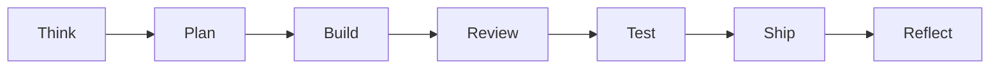

# mstack playbook — running a focused sprint

This page is the **operational** companion to [workflow.md](workflow.md): how to move work through Cursor without blending “plan” and “ship” in one undifferentiated chat.

## Phase loop (short)

## When to use Cursor modes

| Situation | Mode / action |
| --------- | ------------- |
| Unclear requirements, many files, architecture choice | [Plan Mode](https://cursor.com/docs/agent/plan-mode) — refine plan before code |
| Runtime bug, timing, regressions | [Debug Mode](https://cursor.com/docs/agent/debug-mode) — consent for logging per `mstack-debug.mdc` |
| Cost / model fit | `@mstack-model-strategy` — suggestions only; you pick the model |

## Handoff checklist (copy-paste)

Before **Build**, confirm:

- [ ] Goal and **non-goals** stated
- [ ] Plan names **files or areas** to touch (`templates/PLAN_TEMPLATE.md`)
- [ ] Risks noted (`templates/RISK_REGISTER_TEMPLATE.md` if helpful)

Before **Ship**, confirm:

- [ ] Tests / lint run or explicitly skipped with reason
- [ ] Docs: README, ARCHITECTURE, or runbook updated if behavior changed (`templates/DOC_TASK_TEMPLATE.md`)
- [ ] Standing design/product prefs captured in `docs/PROJECT_MEMORY.md` if agreed

## Big bets (product direction)

Before a large **Plan**, consider filling **`templates/PRODUCT_REVIEW_TEMPLATE.md`** and invoking **`@mstack-product-review`** — product posture, **no code** in that pass.

Smaller initiatives: **`templates/PRODUCT_REVIEW_LITE.md`** with the same rule.

### When you skip product review

- **OK:** mechanical fixes, typos, dependency bumps, tests for existing behavior, refactors with an already-approved spec.
- **Not OK:** new user-facing behavior, product positioning, or scope you have not named—do a **lite** or **full** product review first.

## After the sprint

- **Reflect:** `templates/REFLECT_TEMPLATE.md`
- **Incidents:** postmortem templates in `templates/`

## See also

- [ONBOARDING.md](ONBOARDING.md) — first-time setup
- [PACKS.md](PACKS.md) — which rules to copy
- [GSTACK_INSPIRATION.md](GSTACK_INSPIRATION.md) — how this maps to GStack-style roles
