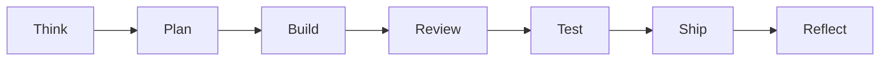

# mstack workflow

mstack separates **cognitive modes** so planning, building, reviewing, and shipping do not blur in one undifferentiated session. Each phase has one job.

## Phases

| Phase | Purpose |
| ----- | ------- |
| **Think** | Clarify goal, constraints, unknowns; list assumptions; ask only for blocking decisions. |
| **Plan** | Architecture, file touch list, risks; use `templates/PLAN_TEMPLATE.md`. |
| **Build** | Minimal diff; follow repo patterns; no scope creep. |
| **Review** | Adversarial pass (correctness, edge cases); **no new features**. |
| **Test** | Proportionate coverage; use `templates/TEST_PLAN_TEMPLATE.md` when relevant. |
| **Ship** | Checklist: tests/lint if present, migrations, rollback notes. |
| **Reflect** | 3–5 bullets: what worked, what to automate next time. |

## Flow

## Artifacts

- **Plan**: `templates/PLAN_TEMPLATE.md`
- **Test plan**: `templates/TEST_PLAN_TEMPLATE.md`
- **Design brief** (UI): `templates/DESIGN_BRIEF_TEMPLATE.md`

## Optional modes

- **Debug**: say *debug mode* or *mstack debug*, or **@mention** `@mstack-debug` in Cursor; Agent follows `mstack-debug.mdc` (hypotheses, bisect, instrumentation).
- **Security pass**: for auth/data/boundary changes, `mstack-security-review.mdc` applies when those files are in scope.

## Cursor integration

Rules live in `.cursor/rules/` as `.mdc` files with YAML frontmatter. See [Cursor Rules](https://cursor.com/docs/rules) for `description`, `globs`, and apply modes.
