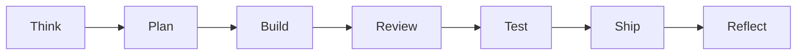

# mstack workflow

mstack separates **cognitive modes** so planning, building, reviewing, and shipping do not blur in one undifferentiated session. Each phase has one job.

**Quick links:** [ONBOARDING.md](ONBOARDING.md) · [PLAYBOOK.md](PLAYBOOK.md) · [POWER_USER.md](POWER_USER.md) · [GSTACK_INSPIRATION.md](GSTACK_INSPIRATION.md) · [TROUBLESHOOTING.md](TROUBLESHOOTING.md) · [CURSOR_LIMITS.md](CURSOR_LIMITS.md)

## Phases

| Phase | Purpose |
| ----- | ------- |
| **Think** | Clarify goal, constraints, unknowns; list assumptions; ask only for blocking decisions. |
| **Plan** | Architecture, file touch list, risks; use `templates/PLAN_TEMPLATE.md`. |
| **Build** | Minimal diff; follow repo patterns; no scope creep. |
| **Review** | Adversarial pass (correctness, edge cases); **no new features**. |
| **Test** | Proportionate coverage; use `templates/TEST_PLAN_TEMPLATE.md` when relevant. |
| **Ship** | Checklist: tests/lint if present, migrations, rollback notes. |
| **Reflect** | 3–5 bullets: what worked, what to automate next time. |

## Flow

## Artifacts

- **Plan**: `templates/PLAN_TEMPLATE.md`
- **Test plan**: `templates/TEST_PLAN_TEMPLATE.md`
- **Design brief** (UI): `templates/DESIGN_BRIEF_TEMPLATE.md`
- **Debug session** (optional): `templates/DEBUG_SESSION_TEMPLATE.md`
- **Session handoff** (optional): root `SESSION_BRIEF.md` from `templates/SESSION_BRIEF_TEMPLATE.md`
- **Reflect**: `templates/REFLECT_TEMPLATE.md`
- **Postmortem** (incidents): `templates/POSTMORTEM_TEMPLATE.md` or `templates/INCIDENT_POSTMORTEM_TEMPLATE.md`
- **PR / ship**: `templates/PR_CHECKLIST_TEMPLATE.md`
- **Architecture decision**: `templates/ADR_TEMPLATE.md`
- **Model strategy** (optional): `templates/MODEL_STRATEGY_NOTE_TEMPLATE.md`
- **API delta** (optional): `templates/OPENAPI_DELTA_TEMPLATE.md`
- **Runbook** (ops): `templates/RUNBOOK_TEMPLATE.md`
- **Project memory** (design / product): `docs/PROJECT_MEMORY.md`; starter for other repos: `templates/PROJECT_MEMORY_TEMPLATE.md`
- **Product review** (before big bets): `templates/PRODUCT_REVIEW_TEMPLATE.md`; smaller scope: `templates/PRODUCT_REVIEW_LITE.md`
- **Doc task list** (after changes): `templates/DOC_TASK_TEMPLATE.md`
- **Risk register** (optional): `templates/RISK_REGISTER_TEMPLATE.md`
- **Repo memory** (this mstack checkout): `docs/AGENT_MEMORY.md`, `docs/ARCHITECTURE.md`, `docs/DECISIONS.md` — keep in sync when behavior or structure changes.
- **Rule presets**: [PACKS.md](PACKS.md)
- **Power-user recipes**: [POWER_USER.md](POWER_USER.md)

## Optional modes

- **Plan Mode**: for **complex features**, **unclear requirements**, or **many files/systems**, use Cursor **Plan Mode** — mode picker or **Shift+Tab**. Agent clarifies, researches the repo, and produces an **editable plan** before implementation; save to workspace when useful. See [Cursor Plan Mode](https://cursor.com/docs/agent/plan-mode).
- **Debug**: say *debug mode* or *mstack debug*, or **@mention** `@mstack-debug`. Follow `mstack-debug.mdc`. For bugs that need **runtime evidence**, use **Cursor Debug Mode**: open Agent, use the **mode picker** or press **Shift+Tab** to switch — see [Cursor Debug Mode](https://cursor.com/docs/agent/debug-mode). mstack requires **explicit user consent** before invasive instrumentation (extra logging, reproduce-for-logs). Without consent, stick to static analysis and suggest Debug Mode + permission when ready.
- **Security pass**: for auth/data/boundary changes, `mstack-security-review.mdc` applies when those files are in scope.
- **Destructive ops**: `mstack-permissions.mdc` — always confirm before `git reset --hard`, force push, `rm -rf`, DB drops, prod changes.
- **Model / cost**: `mstack-model-strategy.mdc` — classify task difficulty, suggest lighter vs stronger model tier and token moves in chat. **Cursor does not allow rules to change the model**; the user switches in the model picker (including Auto). Use `@mstack-model-strategy` when unsure.
- **Session handoff**: `mstack-session-handoff.mdc` — prefer root **`SESSION_BRIEF.md`** (`templates/SESSION_BRIEF_TEMPLATE.md`); next chat reads it + `docs/PROJECT_MEMORY.md`. `@mstack-session-handoff`.
- **Mechanical pass**: `mstack-mechanical-pass.mdc` — chores / trivial fixes; short inline plan. `@mstack-mechanical-pass`.

## Specialist rules

These `.mdc` files add focused guidance; most use `globs` so they apply when matching files are in scope. You can also **@mention** the rule name in chat (for example `@mstack-accessibility`).

| Rule file | When to use |
| --------- | ----------- |
| `mstack-frontend.mdc` | Components, styles, client UI implementation |
| `mstack-accessibility.mdc` | Keyboard, focus, semantics, assistive-tech-friendly UI |
| `mstack-design-research.mdc` | External UI references (with user permission for web research) |
| `mstack-backend.mdc` | APIs, validation, errors, service boundaries |
| `mstack-data-modeling.mdc` | Schema, migrations, SQL, ORM models |
| `mstack-data-migrations.mdc` | Narrow migration-folder safety (pairs with data modeling) |
| `mstack-testing-qa.mdc` | Tests, QA plans, repro steps |
| `mstack-review.mdc` | PR / code review posture (no feature creep) |
| `mstack-ci-quality.mdc` | CI workflows, lint, typecheck, repo-wide tooling |
| `mstack-ci.mdc` | Workflow YAML fixes (narrower than CI/quality) |
| `mstack-docs-devx.mdc` | README, docs, contributing guides, GitHub templates |
| `mstack-docs-ship.mdc` | Changelog / ship-oriented doc touchpoints |
| `mstack-dependencies.mdc` | Manifests and lockfiles |
| `mstack-security-review.mdc` | Auth, data protection, trust boundaries |
| `mstack-debug.mdc` | Structured debugging and permission for invasive steps |
| `mstack-permissions.mdc` | Destructive git, filesystem, DB, prod (always on when included) |
| `mstack-repo-memory.mdc` | This repo’s `docs/AGENT_MEMORY`, architecture, decisions |
| `mstack-model-strategy.mdc` | Model tier + token hints (suggest-only; user changes model in UI) |
| `mstack-session-handoff.mdc` | New chat / multi-agent; prefer root `SESSION_BRIEF.md` |
| `mstack-mechanical-pass.mdc` | Trivial/chore work; compressed plan (not auth/migrations/new UX) |
| `mstack-web-performance.mdc` | CWV, lazy loading, fonts, layout stability, bundler config |
| `mstack-ai-product.mdc` | LLM features, tools, RAG, streaming, injection/PII awareness |
| `mstack-api-contracts.mdc` | Versioning, errors, OpenAPI/spec alignment |
| `mstack-observability.mdc` | Logs, traces, metrics, correlation IDs |
| `mstack-release-versioning.mdc` | Semver, CHANGELOG, release workflows |
| `mstack-project-memory.mdc` | Read/update `PROJECT_MEMORY` for design and product prefs |
| `mstack-product-review.mdc` | Product posture before large plan; no code |
| `mstack-documentation-pass.mdc` | README/docs/runbook alignment before Ship |

## Cursor integration

Rules live in `.cursor/rules/` as `.mdc` files with YAML frontmatter. See [Cursor Rules](https://cursor.com/docs/rules) for `description`, `globs`, and apply modes.
